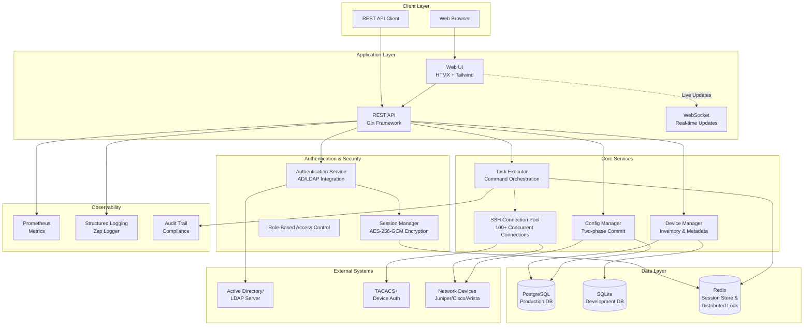
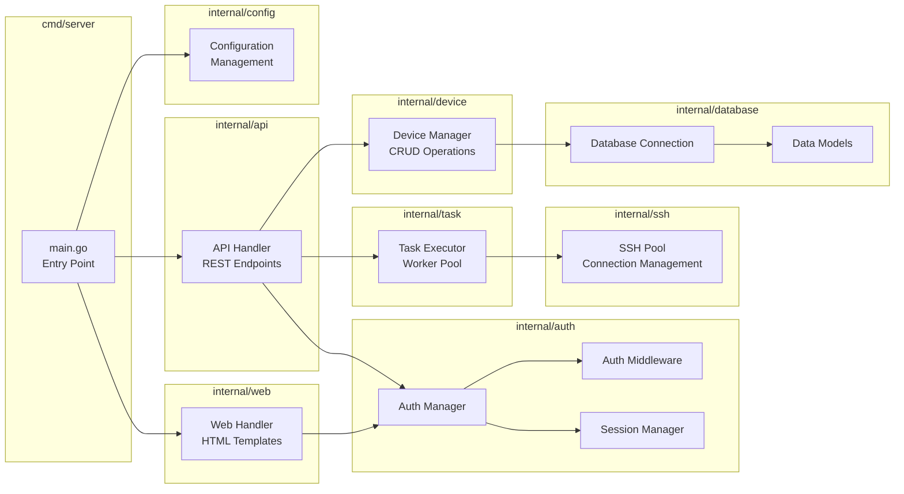
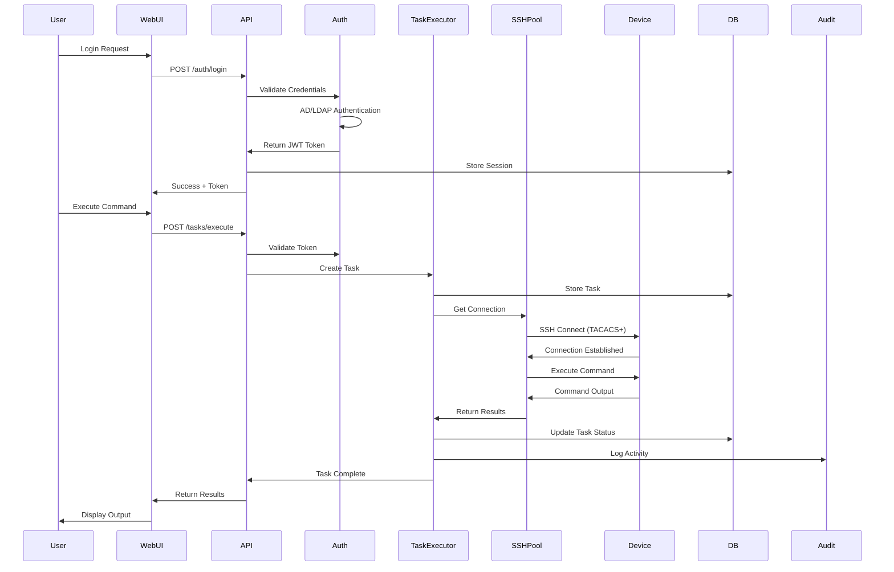
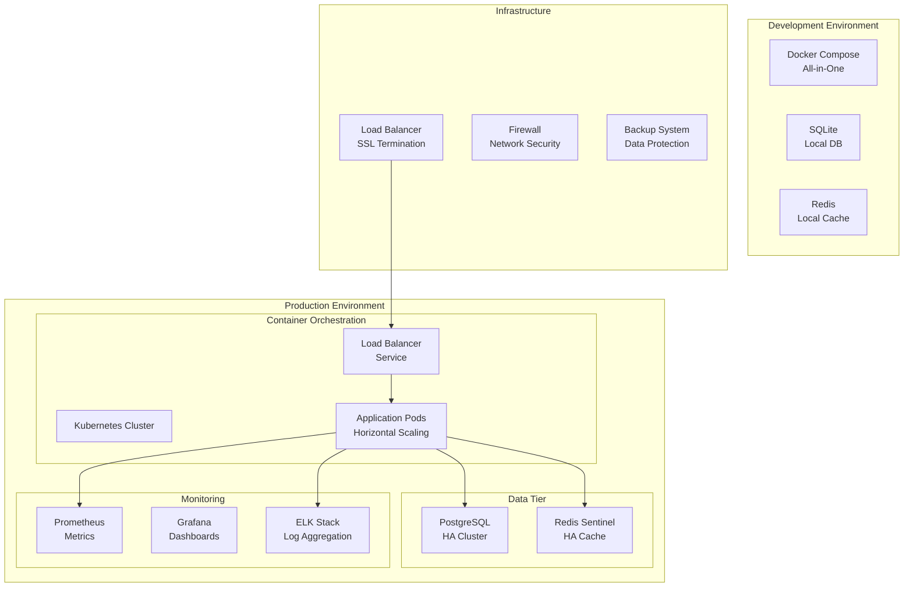
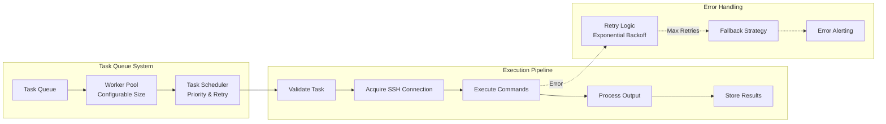
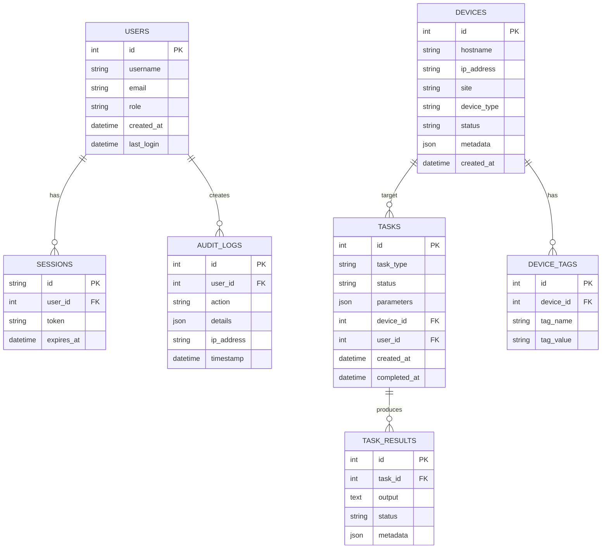

# JunosCommander System Architecture

## Overview
JunosCommander is a production-ready network automation platform designed for managing Juniper Networks devices at scale with enterprise-grade security and high concurrency.

## High-Level Architecture Diagram

## Component Architecture

## Data Flow Diagram

## Security Architecture

```mermaid
graph TD
    subgraph "Security Layers"
        TLS[TLS/HTTPS<br/>Transport Security]
        Auth[Authentication<br/>AD/LDAP]
        Session[Session Security<br/>AES-256-GCM]
        RBAC[Authorization<br/>Role-Based Access]
        Audit[Audit Logging<br/>Complete Trail]
    end

    subgraph "Credential Management"
        NoStore[Zero Credential Storage<br/>Memory-Only]
        Encrypt[In-Memory Encryption]
        TACACS[TACACS+ Integration<br/>Device Auth]
    end

    subgraph "Security Controls"
        RateLimit[Rate Limiting<br/>Brute Force Protection]
        Input[Input Validation<br/>SQL Injection Prevention]
        Timeout[Session Timeout<br/>Idle Detection]
        Logs[Security Logging<br/>Threat Detection]
    end

    TLS --> Auth
    Auth --> Session
    Session --> RBAC
    RBAC --> Audit

    NoStore --> Encrypt
    Encrypt --> TACACS

    RateLimit --> Input
    Input --> Timeout
    Timeout --> Logs
```

## Deployment Architecture

## Task Execution Flow

## Database Schema Overview

## Technology Stack Details

### Backend
- **Language**: Go 1.21+
- **Web Framework**: Gin (High-performance HTTP router)
- **Database**: PostgreSQL (Production), SQLite (Development)
- **Cache**: Redis (Session store, distributed locking)
- **SSH**: golang.org/x/crypto/ssh
- **Authentication**: go-ldap/ldap/v3

### Frontend
- **UI Framework**: HTMX (Dynamic updates without JavaScript frameworks)
- **CSS**: Tailwind CSS (Utility-first styling)
- **Templates**: Go HTML templates
- **Real-time**: WebSockets for live updates

### Infrastructure
- **Containerization**: Docker (Multi-stage builds)
- **Orchestration**: Kubernetes-ready
- **Monitoring**: Prometheus + Grafana
- **Logging**: Structured logging with Zap
- **CI/CD**: GitHub Actions compatible

## Performance Characteristics

| Metric | Specification |
|--------|--------------|
| Concurrent SSH Connections | 100+ |
| Device Inventory Size | 1000+ devices |
| Task Execution Throughput | 50+ tasks/second |
| API Response Time | < 100ms (p95) |
| WebSocket Latency | < 50ms |
| Session Encryption | AES-256-GCM |
| Database Connection Pool | Configurable (default: 25) |
| Worker Pool Size | Configurable (default: 10) |

## Security Features

### Authentication & Authorization
- Active Directory/LDAP integration
- JWT-based session management
- Role-based access control (RBAC)
- Multi-factor authentication ready

### Data Protection
- Zero credential storage (memory-only)
- AES-256-GCM encryption for sessions
- TLS/HTTPS enforcement
- Input validation and sanitization

### Audit & Compliance
- Complete audit trail of all actions
- Structured security logging
- Compliance-ready reporting
- Data retention policies

### Network Security
- TACACS+ for device authentication
- Rate limiting and DDoS protection
- IP allowlisting capability
- Secure WebSocket connections

## Scalability & High Availability

### Horizontal Scaling
- Stateless application design
- Shared session store (Redis)
- Load balancer ready
- Database connection pooling

### High Availability
- Multi-instance deployment support
- Redis Sentinel for cache HA
- PostgreSQL replication support
- Health check endpoints

### Performance Optimization
- Connection pooling (SSH & Database)
- Concurrent task execution
- Efficient device filtering
- Caching strategies

## Monitoring & Observability

### Metrics (Prometheus)
- `ssh_connections_active`: Current SSH connections
- `task_execution_duration`: Task completion times
- `api_request_duration`: API response times
- `auth_attempts_total`: Authentication attempts
- `device_operations_total`: Device operation counts

### Health Endpoints
- `/health`: Application liveness
- `/ready`: Readiness probe
- `/metrics`: Prometheus metrics

### Logging
- Structured JSON logging
- Log levels: DEBUG, INFO, WARN, ERROR
- Correlation IDs for request tracing
- Audit log separation

## Integration Points

### External Systems
1. **Active Directory/LDAP**
   - User authentication
   - Group membership validation

2. **TACACS+ Server**
   - Device authentication
   - Command authorization

3. **Network Devices**
   - Juniper (Primary)
   - Cisco (Supported)
   - Arista (Supported)

### API Integration
- RESTful API design
- JWT authentication
- JSON request/response
- WebSocket for real-time updates

## Disaster Recovery

### Backup Strategy
- Database backups (automated)
- Configuration backups
- Audit log archival
- Recovery time objective (RTO): < 1 hour

### Failover Capabilities
- Automatic session migration
- Graceful shutdown handling
- Task queue persistence
- Connection pool recovery

## Future Enhancements (Roadmap)

1. **Phase 1**: Core Functionality ✅
   - Basic device management
   - Command execution
   - Authentication integration

2. **Phase 2**: Advanced Features
   - Configuration management
   - Scheduled tasks
   - Bulk operations

3. **Phase 3**: Enterprise Features
   - Multi-tenancy support
   - Advanced RBAC
   - Compliance reporting
   - API rate limiting

4. **Phase 4**: Automation
   - Workflow engine
   - Event-driven automation
   - Integration with CI/CD
   - Network validation framework