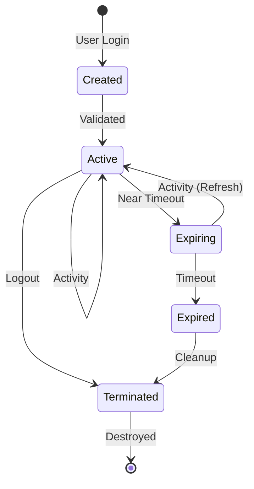
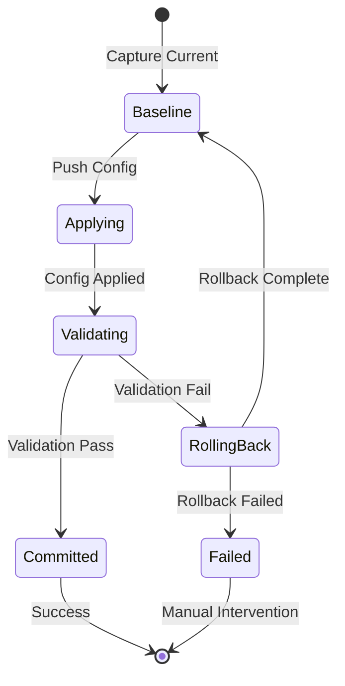

# Technical Design Document - Network Automation Platform

## 1. Executive Summary

This document provides detailed technical design for critical components of the Network Automation Platform, focusing on session management, task execution, device filtering, and configuration rollback mechanisms.

## 2. Session Management Design

### 2.1 Architecture Overview

The session management system provides secure, temporary storage of user credentials in memory with automatic cleanup and encryption.

```go
// Core session structure
type Session struct {
    ID            string
    Username      string
    CreatedAt     time.Time
    LastActivity  time.Time
    ExpiresAt     time.Time
    EncryptedData []byte  // Contains encrypted credentials
    SessionKey    []byte  // Unique per session, stored in memory only
}
```

### 2.2 Credential Encryption Flow

```
User Login → Generate Session Key → Encrypt Credentials → Store in Memory
                     ↓
              AES-256-GCM Encryption
                     ↓
         [Username + Password + Metadata]
                     ↓
              Encrypted Blob in RAM
```

#### 2.2.1 Encryption Implementation

```go
package session

import (
    "crypto/aes"
    "crypto/cipher"
    "crypto/rand"
    "encoding/json"
)

type Credentials struct {
    Username  string    `json:"username"`
    Password  string    `json:"password"`
    Domain    string    `json:"domain"`
    ExpiresAt time.Time `json:"expires_at"`
}

func (s *Session) EncryptCredentials(creds *Credentials) error {
    // Generate session-specific key
    s.SessionKey = make([]byte, 32) // 256-bit key
    if _, err := rand.Read(s.SessionKey); err != nil {
        return err
    }
    
    // Create cipher
    block, err := aes.NewCipher(s.SessionKey)
    if err != nil {
        return err
    }
    
    gcm, err := cipher.NewGCM(block)
    if err != nil {
        return err
    }
    
    // Generate nonce
    nonce := make([]byte, gcm.NonceSize())
    if _, err := rand.Read(nonce); err != nil {
        return err
    }
    
    // Encrypt
    plaintext, _ := json.Marshal(creds)
    s.EncryptedData = gcm.Seal(nonce, nonce, plaintext, nil)
    
    // Clear plaintext from memory
    for i := range plaintext {
        plaintext[i] = 0
    }
    
    return nil
}
```

### 2.3 Session Lifecycle

#### 2.3.1 Session States



#### 2.3.2 Session Storage

```go
type SessionStore struct {
    mu       sync.RWMutex
    sessions map[string]*Session
    cleanup  *time.Ticker
}

func NewSessionStore() *SessionStore {
    store := &SessionStore{
        sessions: make(map[string]*Session),
        cleanup:  time.NewTicker(1 * time.Minute),
    }
    
    go store.cleanupRoutine()
    return store
}

func (s *SessionStore) cleanupRoutine() {
    for range s.cleanup.C {
        s.mu.Lock()
        now := time.Now()
        for id, session := range s.sessions {
            if now.After(session.ExpiresAt) {
                // Securely clear session data
                session.ClearCredentials()
                delete(s.sessions, id)
            }
        }
        s.mu.Unlock()
    }
}
```

### 2.4 Security Considerations

#### 2.4.1 Memory Protection

```go
func (s *Session) ClearCredentials() {
    // Overwrite encryption key
    if s.SessionKey != nil {
        for i := range s.SessionKey {
            s.SessionKey[i] = 0
        }
    }
    
    // Overwrite encrypted data
    if s.EncryptedData != nil {
        for i := range s.EncryptedData {
            s.EncryptedData[i] = 0
        }
    }
    
    // Force garbage collection
    runtime.GC()
}
```

#### 2.4.2 Session Security Controls

- **Session Fixation Prevention**: New session ID on every login
- **Session Timeout**: 8-hour default, configurable
- **Activity Tracking**: Update last activity timestamp
- **Concurrent Session Limits**: Max 5 sessions per user
- **IP Binding**: Optional session-to-IP binding
- **Secure Cookie Attributes**: HttpOnly, Secure, SameSite=Strict

## 3. Task Execution Engine

### 3.1 Worker Pool Architecture

```go
type TaskExecutor struct {
    workers      int
    taskQueue    chan Task
    resultQueue  chan TaskResult
    sshPool      *SSHConnectionPool
    credentials  CredentialProvider
    metrics      *Metrics
}

type Task struct {
    ID          string
    Type        TaskType
    DeviceIDs   []int
    Parameters  map[string]interface{}
    Timeout     time.Duration
    RetryCount  int
    User        string
}
```

### 3.2 Task Distribution Pattern

```
Task Request → Task Queue → Worker Pool → Device Execution
                  ↓             ↓              ↓
              [Buffered]    [Goroutines]  [SSH Sessions]
                              (n=50)
```

#### 3.2.1 Worker Implementation

```go
func (e *TaskExecutor) worker(id int) {
    for task := range e.taskQueue {
        ctx, cancel := context.WithTimeout(context.Background(), task.Timeout)
        defer cancel()
        
        result := e.executeTask(ctx, task)
        e.resultQueue <- result
        
        e.metrics.TaskCompleted(task.Type, result.Status)
    }
}

func (e *TaskExecutor) Start() {
    // Start worker pool
    for i := 0; i < e.workers; i++ {
        go e.worker(i)
    }
    
    // Start result processor
    go e.processResults()
}
```

### 3.3 Connection Pool Management

#### 3.3.1 Pool Structure

```go
type SSHConnectionPool struct {
    mu          sync.RWMutex
    pools       map[string]*DevicePool  // Key: device_id
    maxPerHost  int
    idleTimeout time.Duration
}

type DevicePool struct {
    device      *Device
    connections chan *SSHConnection
    creating    int32  // Atomic counter
    mu          sync.Mutex
}

type SSHConnection struct {
    client      *ssh.Client
    session     *ssh.Session
    lastUsed    time.Time
    inUse       bool
    device      *Device
}
```

#### 3.3.2 Connection Lifecycle

```go
func (p *DevicePool) GetConnection(ctx context.Context, creds *Credentials) (*SSHConnection, error) {
    select {
    case conn := <-p.connections:
        // Validate connection is still alive
        if conn.IsAlive() {
            conn.inUse = true
            conn.lastUsed = time.Now()
            return conn, nil
        }
        // Connection dead, create new one
        conn.Close()
        
    default:
        // No available connections
    }
    
    // Create new connection if under limit
    if atomic.LoadInt32(&p.creating) < int32(p.maxConnections) {
        atomic.AddInt32(&p.creating, 1)
        defer atomic.AddInt32(&p.creating, -1)
        
        return p.createConnection(ctx, creds)
    }
    
    // Wait for available connection
    select {
    case conn := <-p.connections:
        conn.inUse = true
        conn.lastUsed = time.Now()
        return conn, nil
    case <-ctx.Done():
        return nil, ctx.Err()
    }
}
```

### 3.4 Task Types and Handlers

#### 3.4.1 Built-in Task Registry

```go
var taskHandlers = map[TaskType]TaskHandler{
    TaskGetVersion:    handleGetVersion,
    TaskGetConfig:     handleGetConfig,
    TaskGetInterfaces: handleGetInterfaces,
    TaskHealthCheck:   handleHealthCheck,
    TaskCustom:        handleCustomCommand,
}

type TaskHandler func(ctx context.Context, conn *SSHConnection, params map[string]interface{}) (string, error)

func handleGetVersion(ctx context.Context, conn *SSHConnection, params map[string]interface{}) (string, error) {
    commands := map[string]string{
        "cisco_ios":  "show version",
        "cisco_nxos": "show version",
        "arista_eos": "show version",
        "juniper":    "show version",
    }
    
    cmd, ok := commands[conn.device.Type]
    if !ok {
        return "", fmt.Errorf("unsupported device type: %s", conn.device.Type)
    }
    
    return conn.ExecuteCommand(ctx, cmd)
}
```

### 3.5 Error Handling and Retry Logic

```go
type RetryStrategy struct {
    MaxAttempts int
    InitialDelay time.Duration
    MaxDelay     time.Duration
    Multiplier   float64
}

func (e *TaskExecutor) executeWithRetry(ctx context.Context, task Task) TaskResult {
    strategy := RetryStrategy{
        MaxAttempts:  3,
        InitialDelay: 1 * time.Second,
        MaxDelay:     30 * time.Second,
        Multiplier:   2.0,
    }
    
    var lastError error
    delay := strategy.InitialDelay
    
    for attempt := 1; attempt <= strategy.MaxAttempts; attempt++ {
        result, err := e.attemptExecution(ctx, task)
        if err == nil {
            return result
        }
        
        lastError = err
        
        // Check if error is retryable
        if !isRetryable(err) {
            break
        }
        
        // Wait before retry
        select {
        case <-time.After(delay):
            delay = time.Duration(float64(delay) * strategy.Multiplier)
            if delay > strategy.MaxDelay {
                delay = strategy.MaxDelay
            }
        case <-ctx.Done():
            return TaskResult{
                Status: TaskStatusFailed,
                Error:  ctx.Err().Error(),
            }
        }
    }
    
    return TaskResult{
        Status: TaskStatusFailed,
        Error:  lastError.Error(),
    }
}
```

## 4. Device Filtering Engine

### 4.1 Query Language Design

#### 4.1.1 Filter Expression Grammar

```bnf
filter_expression ::= condition | logical_expression
logical_expression ::= filter_expression AND filter_expression
                     | filter_expression OR filter_expression
                     | NOT filter_expression
                     | '(' filter_expression ')'
condition ::= field operator value
field ::= 'hostname' | 'ip_address' | 'site_name' | 'device_type' | 
          'device_sub_type' | 'tag' | 'sw_version' | 'status'
operator ::= '=' | '!=' | '~' | 'IN' | 'NOT IN' | '>' | '<' | 'CONTAINS'
value ::= string | number | array | regex
```

#### 4.1.2 Query Examples

```sql
-- Simple equality
site_name = 'HQ'

-- Multiple conditions with AND
site_name = 'HQ' AND device_type = 'cisco_ios'

-- OR logic
site_name = 'HQ' OR site_name = 'BRANCH1'

-- IN operator
site_name IN ('HQ', 'BRANCH1', 'BRANCH2')

-- Regex matching
hostname ~ '^core-.*'

-- Tag contains
tag CONTAINS 'production'

-- Complex query
(site_name = 'HQ' OR site_name = 'DATACENTER') 
AND device_type IN ('cisco_ios', 'cisco_nxos') 
AND tag CONTAINS 'production'
AND NOT status = 'maintenance'
```

### 4.2 Filter Implementation

#### 4.2.1 Filter Parser

```go
type FilterExpression interface {
    Evaluate(device *Device) bool
    ToSQL() (string, []interface{})
}

type AndExpression struct {
    Left  FilterExpression
    Right FilterExpression
}

func (e *AndExpression) Evaluate(device *Device) bool {
    return e.Left.Evaluate(device) && e.Right.Evaluate(device)
}

func (e *AndExpression) ToSQL() (string, []interface{}) {
    leftSQL, leftArgs := e.Left.ToSQL()
    rightSQL, rightArgs := e.Right.ToSQL()
    
    sql := fmt.Sprintf("(%s AND %s)", leftSQL, rightSQL)
    args := append(leftArgs, rightArgs...)
    
    return sql, args
}
```

#### 4.2.2 Filter Compiler

```go
type FilterCompiler struct {
    lexer  *Lexer
    parser *Parser
}

func (c *FilterCompiler) Compile(query string) (FilterExpression, error) {
    tokens := c.lexer.Tokenize(query)
    ast := c.parser.Parse(tokens)
    return c.optimize(ast), nil
}

func (c *FilterCompiler) optimize(expr FilterExpression) FilterExpression {
    // Optimization passes
    expr = c.constantFolding(expr)
    expr = c.predicatePushdown(expr)
    expr = c.indexOptimization(expr)
    return expr
}
```

### 4.3 Performance Optimization

#### 4.3.1 Query Caching

```go
type FilterCache struct {
    mu    sync.RWMutex
    cache map[string]CachedFilter
    lru   *list.List
    size  int
}

type CachedFilter struct {
    Query      string
    Expression FilterExpression
    SQL        string
    Args       []interface{}
    LastUsed   time.Time
}

func (c *FilterCache) Get(query string) (FilterExpression, bool) {
    c.mu.RLock()
    defer c.mu.RUnlock()
    
    if cached, ok := c.cache[query]; ok {
        cached.LastUsed = time.Now()
        return cached.Expression, true
    }
    
    return nil, false
}
```

#### 4.3.2 Index Hints

```go
type IndexHint struct {
    Field    string
    Priority int
}

var indexPriority = map[string]int{
    "hostname":   1,  // Unique index, highest priority
    "site_name":  2,  // Frequently filtered
    "device_type": 3,
    "status":     4,
    "tag":        5,  // Text search, lower priority
}

func selectBestIndex(conditions []Condition) string {
    var bestIndex IndexHint
    
    for _, cond := range conditions {
        if priority, ok := indexPriority[cond.Field]; ok {
            if bestIndex.Field == "" || priority < bestIndex.Priority {
                bestIndex = IndexHint{
                    Field:    cond.Field,
                    Priority: priority,
                }
            }
        }
    }
    
    return bestIndex.Field
}
```

## 5. Configuration Rollback Mechanism

### 5.1 Rollback Architecture

#### 5.1.1 Configuration State Machine



#### 5.1.2 Rollback Data Structure

```go
type ConfigTransaction struct {
    ID              string
    DeviceID        int
    User            string
    StartTime       time.Time
    BaselineConfig  string
    TargetConfig    []string
    AppliedCommands []string
    Status          TransactionStatus
    RollbackPlan    []string
    ValidationRules []ValidationRule
}

type ValidationRule struct {
    Type        string // "interface_up", "route_exists", "ping_test"
    Parameters  map[string]interface{}
    Expected    interface{}
    Actual      interface{}
    Passed      bool
}
```

### 5.2 Rollback Implementation

#### 5.2.1 Configuration Capture

```go
func (r *RollbackManager) captureBaseline(ctx context.Context, device *Device) (string, error) {
    conn, err := r.pool.GetConnection(ctx, device)
    if err != nil {
        return "", err
    }
    defer r.pool.ReturnConnection(conn)
    
    // Capture running configuration
    config, err := conn.ExecuteCommand(ctx, "show running-config")
    if err != nil {
        return "", err
    }
    
    // Store with hash for comparison
    hash := sha256.Sum256([]byte(config))
    
    baseline := ConfigBaseline{
        DeviceID:  device.ID,
        Config:    config,
        Hash:      hex.EncodeToString(hash[:]),
        Timestamp: time.Now(),
    }
    
    if err := r.store.SaveBaseline(baseline); err != nil {
        return "", err
    }
    
    return baseline.Hash, nil
}
```

#### 5.2.2 Change Detection and Rollback Plan

```go
func (r *RollbackManager) generateRollbackPlan(baseline, current string, commands []string) []string {
    // Parse configurations
    baselineTree := r.parser.Parse(baseline)
    currentTree := r.parser.Parse(current)
    
    // Calculate diff
    diff := r.differ.Compare(baselineTree, currentTree)
    
    // Generate rollback commands
    var rollbackCmds []string
    
    for _, change := range diff.Changes {
        switch change.Type {
        case ChangeTypeAdd:
            // Remove added configuration
            rollbackCmds = append(rollbackCmds, 
                r.generateDeleteCommand(change.Path, change.Value))
            
        case ChangeTypeDelete:
            // Restore deleted configuration
            rollbackCmds = append(rollbackCmds,
                r.generateAddCommand(change.Path, change.OldValue))
            
        case ChangeTypeModify:
            // Revert to original value
            rollbackCmds = append(rollbackCmds,
                r.generateModifyCommand(change.Path, change.OldValue))
        }
    }
    
    return r.optimizeCommands(rollbackCmds)
}
```

#### 5.2.3 Validation Framework

```go
type Validator struct {
    rules []ValidationRule
}

func (v *Validator) Validate(ctx context.Context, conn *SSHConnection) ValidationResult {
    result := ValidationResult{
        Passed: true,
        Rules:  make([]RuleResult, 0, len(v.rules)),
    }
    
    for _, rule := range v.rules {
        ruleResult := v.executeRule(ctx, conn, rule)
        result.Rules = append(result.Rules, ruleResult)
        
        if !ruleResult.Passed && rule.Critical {
            result.Passed = false
            if rule.StopOnFailure {
                break
            }
        }
    }
    
    return result
}

func (v *Validator) executeRule(ctx context.Context, conn *SSHConnection, rule ValidationRule) RuleResult {
    switch rule.Type {
    case "interface_status":
        return v.validateInterfaceStatus(ctx, conn, rule)
    case "routing_table":
        return v.validateRoutingTable(ctx, conn, rule)
    case "connectivity":
        return v.validateConnectivity(ctx, conn, rule)
    default:
        return RuleResult{
            Passed: false,
            Error:  fmt.Sprintf("unknown rule type: %s", rule.Type),
        }
    }
}
```

### 5.3 Two-Phase Commit

```go
func (r *RollbackManager) TwoPhaseCommit(ctx context.Context, devices []*Device, commands []string) error {
    // Phase 1: Prepare
    transactions := make(map[int]*ConfigTransaction)
    
    for _, device := range devices {
        tx, err := r.prepare(ctx, device, commands)
        if err != nil {
            // Abort all transactions
            r.abortAll(transactions)
            return err
        }
        transactions[device.ID] = tx
    }
    
    // Phase 2: Commit or Rollback
    for deviceID, tx := range transactions {
        if err := r.validate(ctx, tx); err != nil {
            // Validation failed, rollback all
            r.rollbackAll(transactions)
            return fmt.Errorf("validation failed on device %d: %w", deviceID, err)
        }
    }
    
    // All validated, commit
    for _, tx := range transactions {
        if err := r.commit(ctx, tx); err != nil {
            // This is bad - partial commit state
            r.handlePartialCommit(transactions, tx)
            return err
        }
    }
    
    return nil
}
```

## 6. Monitoring and Observability

### 6.1 Metrics Collection

```go
type Metrics struct {
    // Counters
    TasksTotal        *prometheus.CounterVec
    AuthAttempts      *prometheus.CounterVec
    SSHConnections    *prometheus.CounterVec
    
    // Gauges
    ActiveSessions    prometheus.Gauge
    ConnectionPool    *prometheus.GaugeVec
    QueueDepth        prometheus.Gauge
    
    // Histograms
    TaskDuration      *prometheus.HistogramVec
    APILatency        *prometheus.HistogramVec
    SSHCommandTime    *prometheus.HistogramVec
}

func NewMetrics() *Metrics {
    return &Metrics{
        TasksTotal: prometheus.NewCounterVec(
            prometheus.CounterOpts{
                Name: "tasks_total",
                Help: "Total number of tasks executed",
            },
            []string{"type", "status"},
        ),
        // ... other metrics
    }
}
```

### 6.2 Structured Logging

```go
type Logger struct {
    zap *zap.Logger
}

func (l *Logger) LogTaskExecution(task Task, result TaskResult) {
    l.zap.Info("task_executed",
        zap.String("task_id", task.ID),
        zap.String("task_type", string(task.Type)),
        zap.String("user", task.User),
        zap.Int("device_count", len(task.DeviceIDs)),
        zap.String("status", string(result.Status)),
        zap.Duration("duration", result.Duration),
        zap.String("correlation_id", task.CorrelationID),
    )
}
```

### 6.3 Audit Trail

```go
type AuditLogger struct {
    db *sql.DB
}

type AuditEntry struct {
    ID            int64
    Timestamp     time.Time
    User          string
    Action        string
    ResourceType  string
    ResourceID    string
    Changes       json.RawMessage
    IPAddress     string
    SessionID     string
    Success       bool
    ErrorMessage  string
}

func (a *AuditLogger) LogConfigChange(user string, device *Device, commands []string, success bool) {
    entry := AuditEntry{
        Timestamp:    time.Now(),
        User:         user,
        Action:       "config_change",
        ResourceType: "device",
        ResourceID:   strconv.Itoa(device.ID),
        Changes:      json.RawMessage(commands),
        Success:      success,
    }
    
    a.store(entry)
}
```

## 7. Testing Strategy

### 7.1 Unit Testing

```go
func TestSessionEncryption(t *testing.T) {
    session := NewSession()
    creds := &Credentials{
        Username: "testuser",
        Password: "testpass",
    }
    
    err := session.EncryptCredentials(creds)
    assert.NoError(t, err)
    
    decrypted, err := session.DecryptCredentials()
    assert.NoError(t, err)
    assert.Equal(t, creds.Username, decrypted.Username)
    
    // Ensure cleanup works
    session.ClearCredentials()
    assert.Nil(t, session.SessionKey)
}
```

### 7.2 Integration Testing

```go
func TestEndToEndTaskExecution(t *testing.T) {
    // Setup test environment
    ctx := context.Background()
    executor := NewTaskExecutor()
    
    // Create test task
    task := Task{
        Type:      TaskGetVersion,
        DeviceIDs: []int{1, 2, 3},
        User:      "testuser",
    }
    
    // Execute
    result := executor.Execute(ctx, task)
    
    // Verify
    assert.Equal(t, TaskStatusCompleted, result.Status)
    assert.Len(t, result.DeviceResults, 3)
}
```

### 7.3 Performance Testing

```go
func BenchmarkConcurrentSSHConnections(b *testing.B) {
    pool := NewSSHConnectionPool()
    devices := generateTestDevices(100)
    
    b.ResetTimer()
    b.RunParallel(func(pb *testing.PB) {
        for pb.Next() {
            device := devices[rand.Intn(len(devices))]
            conn, _ := pool.GetConnection(context.Background(), device)
            defer pool.ReturnConnection(conn)
            
            conn.ExecuteCommand(context.Background(), "show version")
        }
    })
}
```

## 8. Security Considerations

### 8.1 Threat Model

| Threat | Mitigation |
|--------|------------|
| Credential theft from memory | Encryption, immediate cleanup, memory protection |
| Session hijacking | Session binding, token rotation |
| Privilege escalation | RBAC, audit logging |
| Command injection | Input validation, parameterized commands |
| Man-in-the-middle | TLS/SSH host key verification |
| Denial of service | Rate limiting, connection limits |

### 8.2 Security Controls

```go
// Input validation
func validateCommand(cmd string) error {
    // Deny list of dangerous commands
    denied := []string{
        "format", "delete flash:", "reload", "write erase",
    }
    
    for _, dangerous := range denied {
        if strings.Contains(strings.ToLower(cmd), dangerous) {
            return fmt.Errorf("command contains dangerous operation: %s", dangerous)
        }
    }
    
    // Validate command structure
    if !isValidCommandSyntax(cmd) {
        return fmt.Errorf("invalid command syntax")
    }
    
    return nil
}

// Rate limiting
type RateLimiter struct {
    limiter *rate.Limiter
    limits  map[string]*rate.Limiter
    mu      sync.RWMutex
}

func (r *RateLimiter) Allow(user string) bool {
    r.mu.Lock()
    defer r.mu.Unlock()
    
    if l, exists := r.limits[user]; exists {
        return l.Allow()
    }
    
    // Create new limiter for user
    l := rate.NewLimiter(rate.Every(time.Second), 10) // 10 requests per second
    r.limits[user] = l
    
    return l.Allow()
}
```

## 9. Deployment Considerations

### 9.1 Container Security

```dockerfile
# Multi-stage build for minimal attack surface
FROM golang:1.21-alpine AS builder
RUN apk add --no-cache git
WORKDIR /build
COPY . .
RUN go build -ldflags="-w -s" -o app ./cmd/server

FROM alpine:latest
RUN apk add --no-cache ca-certificates
RUN adduser -D -g '' appuser
COPY --from=builder /build/app /app
USER appuser
ENTRYPOINT ["/app"]
```

### 9.2 Environment Configuration

```yaml
# config/production.yaml
server:
  address: "0.0.0.0:8080"
  tls:
    enabled: true
    cert_file: "/certs/server.crt"
    key_file: "/certs/server.key"
    
security:
  session_timeout: 28800  # 8 hours
  max_sessions_per_user: 5
  require_tls: true
  allowed_ips:
    - "10.0.0.0/8"
    - "172.16.0.0/12"
    
performance:
  worker_pool_size: 50
  connection_pool_size: 10
  max_concurrent_tasks: 100
  task_timeout: 60
```

## 10. Future Considerations

### 10.1 Scalability Enhancements
- Distributed task execution using NATS/RabbitMQ
- Horizontal scaling with shared session store (Redis)
- Database sharding for large deployments

### 10.2 Feature Additions
- GitOps integration for configuration as code
- Compliance validation engine
- Machine learning for anomaly detection
- Automated remediation workflows

### 10.3 Technology Upgrades
- WebAssembly plugins for custom tasks
- GraphQL API option
- gRPC for internal service communication
- OpenTelemetry for distributed tracing
